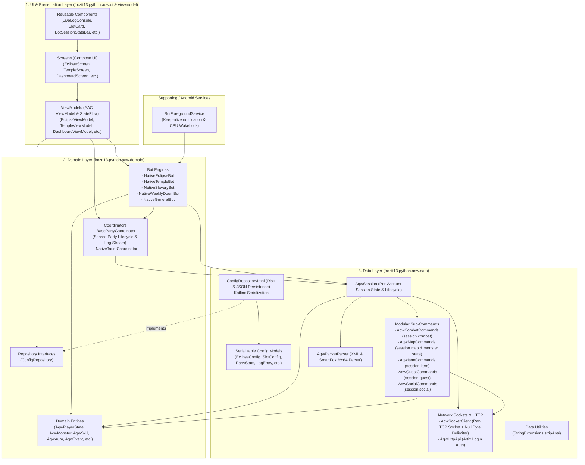

# Arsitektur & Dokumentasi Teknis AQW Android Bot (Clean Architecture)

Dokumen ini menjelaskan struktur arsitektur menyeluruh dari aplikasi **AQW Android Bot**. Proyek ini
telah direfaktor mengadopsi pola **Clean Architecture 3-Tier** (`UI` -> `Domain` -> `Data`) guna
memisahkan antarmuka pengguna (UI/Compose), logika bisnis gameplay (Domain/Coordinators/Bots), dan
lapisan jaringan serta engine protokol permainan (Data/Session/Network).

---

## 1. Diagram Arsitektur Tingkat Tinggi (High-Level Architecture)



---

## 2. Rincian Lapisan Sistem (Layer Breakdown)

### Lapisan 1: UI & Presentation Layer (`froztt13.python.aqw.ui` & `viewmodel`)

Lapisan presentasi yang berinteraksi langsung dengan pengguna, dibangun menggunakan **Jetpack
Compose** dan pola **MVVM**.

- **Screens (`ui/screens`)**:
    - `DashboardScreen.kt`: Hub ringkasan metrik semua modul bot (Eclipse, Temple, Slavery, Doom,
      General) yang berjalan bersamaan.
    - `EclipseScreen.kt`: Kontrol raid Maid Eclipse (pengaturan server/room, toggle Light Gather,
      slot configuration via ViewPager/Tab, live console, dan telemetry boss).
    - `TempleScreen.kt`: Kontrol raid Maid Temple Shrine (Grimskull, Priest, Ninja, dungeon
      coordination, dan Anim Msg monitor).
    - `SlaveryScreen.kt` & `SlaverySettingsScreen.kt`: Manajemen bot farming multi-akun /
      multi-room.
    - `WeeklyDoomScreen.kt`: Otomasi quest mingguan / Weekly Doom dungeon.
    - `GeneralBotScreen.kt`: Bot umum untuk farming quest / item custom.
    - `PlayerStateScreen.kt`: Telemetri mendalam akun game (detail inventory, equipment, skill, dan
      stats).

- **Components (`ui/components`)**:
    - `LiveLogConsole.kt`: Penampil konsol log real-time dengan filter slot/akun dan pemantau paket
      outgoing socket. Menggunakan extension `stripAnsi()` secara langsung.
    - `SlotCard.kt`: Komponen konfigurasi kredensial (username/password), role, target monster,
      class, serta indikator HP/MP live.
    - `BotSessionStatsBar.kt`: Tombol kontrol utama (Start, Pause, Resume, Stop) dan telemetri
      elapsed time / count cleared.
    - `EclipseTauntOverviewCard.kt` & `MonsterTelemetryCard.kt`: Visualisasi HP boss, urutan giliran
      taunt, dan status monster cell.

- **ViewModels (`viewmodel`)**:
    - Menjaga state reaktif menggunakan `StateFlow` dan menangani lifecycle UI.
    - Berkomunikasi langsung dengan **Domain Coordinators** / Bot singletons dan *
      *`ConfigRepository`** untuk memuat dan menyimpan konfigurasi.
    - Menghindari akses langsung ke socket maupun packet parser.

---

### Lapisan 2: Domain Layer (`froztt13.python.aqw.domain`)

Lapisan inti logika bisnis AQW. Bersifat murni (pure Kotlin) tanpa ketergantungan pada UI Android
atau koneksi socket mentah.

- **Coordinators (`domain/coordinator`)**:
    - `BasePartyCoordinator.kt`: Kelas dasar berstandar untuk seluruh bot multi-slot (mengatur
      lifecycle party, slot tracking, status pause/resume, kalkulasi party stats, dan pengumpulan
      per-slot session log stream).
    - `NativeTauntCoordinator.kt`: Logika perhitungan giliran taunt dan koordinasi timing skill 5.

- **Bot Engines (`domain/bot.*`)**:
    - `domain/bot/eclipse/NativeEclipseBot.kt`: Mengelola 4 instance `AqwSession`, rotasi taunt
      Sun/Moon, handling aura debuff (*Sun's Warmth*, *Moonlight Gaze*, *Light Gather*), pembacaan
      peringatan boss (*ANIM MSG*), koordinasi jump cell serentak, dan auto dungeon restart.
      Mewarisi `BasePartyCoordinator`.
    - `domain/bot/temple/NativeTempleBot.kt`: Mengelola party dungeon Temple Shrine. Mewarisi
      `BasePartyCoordinator`.
    - `domain/bot/slavery/NativeSlaveryBot.kt`, `domain/bot/doom/NativeWeeklyDoomBot.kt`,
      `domain/bot/general/NativeGeneralBot.kt`: Implementasi bot engine untuk use-case farming dan
      quest spesifik.

- **Domain Models (`domain/model/AqwModels.kt`)**:
    - Model entitas game: `AqwPlayerState`, `AqwMonster`, `AqwSkill`, `AqwAura`, `AqwItem`,
      `AqwOtherPlayer`, dan hierarki sealed interface `AqwEvent` (`AqwEvent.CombatTick`,
      `AqwEvent.MonsterSpawned`, `AqwEvent.UserCastSpell`, dll.).

- **Repository Interfaces (`domain/repository`)**:
    - `ConfigRepository.kt`: Kontrak abstraksi penyimpanan konfigurasi (load, save, reset untuk
      setiap modul bot).

---

### Lapisan 3: Data Layer (`froztt13.python.aqw.data`)

Lapisan penyedia data, engine protokol, jaringan, dan persistensi penyimpanan.

- **Game Engine & Session (`data/engine`)**:
    - `AqwSession.kt`: Representasi satu akun/koneksi aktif:
        - Menyimpan `AqwPlayerState` (username, level, HP, MP, cell, pad, combat state, loaded
          auras).
        - Memiliki buffer log lokal (`logs: StateFlow<List<LogEntry>>`) yang terisolasi per akun.
        - Mengelola pipeline event reaktif `events: SharedFlow<AqwEvent>`.
        - Menginstansiasi modular sub-commands secara langsung (`combat`, `map`, `item`, `quest`,
          `social`).
    - `AqwPacketParser.kt`:
        - Mengurai paket teks protokol AQW (XML policy/login response, SmartFox `%xt%zm%...%`, dan
          JSON payload).
        - Mengonversi paket mentah menjadi `AqwEvent` yang dikirim ke `AqwSession.events`.

- **Modular Sub-Commands (`data/engine/commands`)**:
    - `AqwCombatCommands.kt` (`session.combat`): Eksekusi auto-attack (`gar`), casting skill 1–5 (
      `castSkill`), seleksi target monster/player, validasi cooldown & mana, scroll/potion equip,
      dan taunt lock.
    - `AqwMapCommands.kt` (`session.map`): Pengendali navigasi cell/pad (`moveToCell`, `jumpCell`)
      dan **pemilik tunggal state monster peta** (`allMonsters`, `getMonsters()`,
      `getCellMonsters()`, `hasAliveMonsters()`, update HP/status monster).
    - `AqwItemCommands.kt` (`session.item`): Ambil drop (`getDrop`), ambil semua drop (`dropStack`),
      transfer bank/inventory, equip item.
    - `AqwQuestCommands.kt` (`session.quest`): Ambil quest (`getQuest`), selesaikan quest (
      `tryCompleteQuest`), terima reward quest.
    - `AqwSocialCommands.kt` (`session.social`): Kirim invite party, terima invite, dan keluar
      party.

- **Network & Transport (`data/network`)**:
    - `AqwSocketClient.kt`: Raw TCP Socket (`java.net.Socket`) ke server AQW (port 5588). Menangani
      framing paket dengan delimiter byte null (`\u0000`), queue pengiriman pesan, logging outgoing
      packets (`packetLogs`), serta auto-reconnect/heartbeat ping.
    - `AqwHttpApi.kt`: Berkomunikasi dengan Web API Artix via HTTPS untuk validasi login pengguna,
      perolehan user token, dan daftar server aktif.

- **Repository & Persistence (`data/repository` & `data/model`)**:
    - `ConfigRepositoryImpl.kt`: Implementasi `ConfigRepository` berbasis internal storage (
      `filesDir`) menggunakan JSON serializer.
    - `data/model/*`: Berkas data class terpisah dan type-safe beranotasi `@Serializable` (
      `EclipseConfig.kt`, `TempleConfig.kt`, `SlaveryConfig.kt`, `WeeklyDoomConfig.kt`,
      `SlotConfig.kt`, `PartyStats.kt`, `LogEntry.kt`, dll.) lengkap dengan fungsi `toJson()` dan
      `fromJson()`.

- **Utilities (`data/util`)**:
    - `StringExtensions.kt`: Fungsi ekstensi string murni seperti `String.stripAnsi()`.

---

### Lapisan Pendukung (Supporting Services)

- **`froztt13.python.aqw.service.BotForegroundService`**:
    - Menjalankan bot dalam Foreground Service Android dengan persistent notification agar socket
      game tidak diputus oleh Doze Mode Android saat layar mati.

---

## 3. Alur Eksekusi: Dari Klik "Start Bot" Hingga Aksi Game

```
1. Pengguna klik "Start Bot" pada EclipseScreen (UI)
   ↓
2. EclipseViewModel memanggil NativeEclipseBot.start(config)
   ↓
3. BotForegroundService aktif di Android (keep-alive notification & CPU wake-lock)
   ↓
4. NativeEclipseBot menginisiasi 4 instance AqwSession (slot1 .. slot4)
   ↓
5. AqwSession memanggil AqwHttpApi untuk login kredensial & mendapatkan server IP
   ↓
6. AqwSocketClient membuka koneksi TCP Socket ke game server AQW
   ↓
7. Paket data masuk dari server SmartFox -> Diparsing oleh AqwPacketParser -> Menghasilkan AqwEvent
   ↓
8. AqwSession menerima event -> Menjalankan sub-commands modular:
   - session.map.getMonsters(...) / session.map.jumpCell(...)
   - session.combat.castSkill(...) / session.combat.autoAttack()
   - session.quest.tryCompleteQuest(...)
   ↓
9. Pesan log dicatat langsung ke AqwSession.logs -> Dikonsumsi secara reaktif oleh BasePartyCoordinator.slotLogs atau bot engine logs
   ↓
10. ViewModel meneruskan StateFlow log stream ke LiveLogConsole pada Screen UI (UI terupdate secara real-time)
```

---

## 4. Konvensi & Aturan Arsitektur (Guidelines)

1. **Dependency Inversion**:
    - Lapisan `Domain` tidak boleh mengimpor kelas UI (`Compose`, `ViewModel`) maupun implementasi
      low-level jaringan (`AqwSocketClient`).
    - Lapisan `UI` mengakses data melalui `ViewModel`, dan `ViewModel` berinteraksi dengan
      `Domain` (`Coordinator`, `Bot`, `ConfigRepository`).
2. **Modular Commands**:
    - Hindari membuat god-object command handler. Seluruh perintah game harus dipanggil melalui
      modul domain terkait di session (`session.combat`, `session.map`, `session.item`,
      `session.quest`, `session.social`).
3. **Penyimpanan State Monster**:
    - Seluruh mutasi dan querying monster peta harus melalui `session.map` (`AqwMapCommands`), bukan
      langsung di session atau command combat.
4. **Type-Safe Configuration**:
    - Setiap model konfigurasi disimpan dalam package `data/model` dengan anotasi `@Serializable`,
      diakses melalui `ConfigRepositoryImpl`.
5. **Reactive Logging & State Streaming**:
    - Seluruh logging dilakukan langsung melalui `session.log(slotKey, message, type)`.
    - ViewModel mengamati log secara reaktif melalui `StateFlow<List<LogEntry>>` (untuk single
      session bot seperti `NativeGeneralBot`, `NativeWeeklyDoomBot`) atau
      `StateFlow<Map<String, List<LogEntry>>>` (untuk multi-slot bot via `BasePartyCoordinator` /
      `NativeSlaveryBot`), tanpa perantara singleton statis global.
